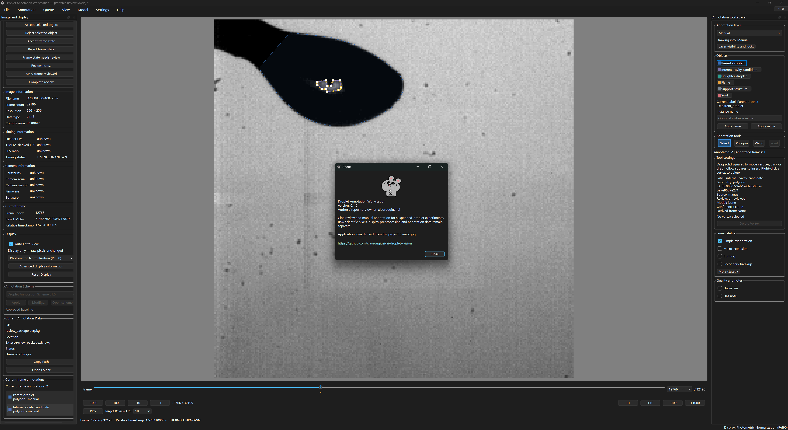

# Droplet Vision


**High-Speed Droplet Annotation, Review and AI-Assisted Quantification Workstation**

用于高速液滴 Cine 数据浏览、人工标注、协同审阅和未来 AI 辅助定量分析的科研工作站。

Droplet Vision provides the **Droplet Annotation Workstation** desktop UI for
read-only Phantom Cine viewing, traceable human annotation and offline review.
AI-assisted quantification is the long-term direction: trained models,
automated physical measurements and event detection are **not supplied**.

## Why Droplet Vision?

High-speed experiments produce more frames than researchers can label exhaustively.
Reproducible access, sparse sampling and human review turn visual observations into
records whose geometry, timing and revisions can be checked later.

```text
Cine → reproducible access → assisted annotation → human review
                                               → future prediction → measurement
```

A segmentation model is one replaceable module. It does not establish physical
phase identity or experimental timing validity.

## Feature Overview

| Status | Capability |
| --- | --- |
| Implemented | Read-only Cine access, metadata, raw TIME64 and conservative timing diagnostics |
| Implemented | Asynchronous Viewer, bounded raw cache, zoom/pan/Auto Fit, raw PNG export and ViewerSession |
| Implemented | Cine-locked Photometric Normalization (Ref90), Raw, Manual and Auto display modes |
| Implemented | Polygon drafts, vertex/midpoint editing, Point, raw-grayscale Magic Wand and Undo/Redo |
| Implemented | Scheme-driven objects/colors, daughter numbering, bilingual live UI and clickable annotation markers |
| Implemented | Multi-label Frame State, separate quality/notes, immutable history and atomic AnnotationDocument saving |
| Implemented | Deterministic sampling, resumable Annotation Queue and offline `.dvrpkg` review/merge |
| Experimental scope | Magic Wand proposals and the human-reviewed Ref90 preprocessing candidate require visual judgment |
| Planned | Dataset export, production Prediction Store/import, YOLO-seg/U-Net integration, tracking, measurement and temporal event inference |

Implemented describes source capabilities, not a published release or validation
on every Phantom encoding. See [limitations](#known-limitations).

## Interface Overview



Example workspace in Portable Review Mode, with object overlays, annotation
controls, Frame State options and the About dialog. The screenshot is an
interface example, not a validated physical interpretation of the image.

| Area | Purpose |
| --- | --- |
| Left | Cine/timing/camera/current-frame information, display, Scheme, document location and current annotations |
| Center | Raw-coordinate image canvas and editable overlays |
| Right | Drawing layer, object buttons, tools, tool settings, Frame State and quality/notes |
| Bottom | Human-annotation markers, timeline, fixed frame jumps and independent Review Speed (frames/s) |

Queue and bookmarks have separate docks. Menus: **File → Annotation → Queue →
View → Model → Settings → Help**. 中文 is the default; the language button or
Settings changes visible text immediately without discarding editing state.

## Quick Start

After [installation](#installation), run at repository root in the activated environment:

```powershell
python scripts/launch_viewer.py
```

Windows also supports `launch_viewer.cmd`. For double-click use with an external
environment, put its interpreter path in ignored `configs/viewer.local.txt`;
see [launcher setup](docs/getting_started.md#launch). It does not install packages
or silently choose system Python.

1. **File → Open Cine…**; wait for the image and reference initialization.
2. Apply an **Annotation Scheme**, then choose the unlocked **Manual** drawing layer.
3. Choose an object, draw a Polygon, close the dashed draft, adjust it and **Confirm**.
4. Set Frame State and quality/notes; **Annotation → Save Annotations**.
5. Use [Queue](docs/frame_sampling_queue.md) for sampled work or
   [review packages](docs/portable_review_package.md) for collaboration.

The [Getting Started guide](docs/getting_started.md) covers a complete first session.

## Installation

Use a source checkout: runtime schemes/presets live in `configs/`. Windows with
Python 3.12 is the tested desktop setup. The package declares Python `>=3.9`;
that declaration does not mean the full UI was validated on 3.9.

```powershell
git clone https://github.com/xiaorouqiuzi-ai/droplet--vision.git
cd droplet--vision
python -m venv .venv
.\.venv\Scripts\Activate.ps1
python -m pip install --upgrade pip
python -m pip install -e ".[cine,ui]"
python -m pip check
python -c "import sys; print(sys.executable); print(sys.version)"
```

If activation is unavailable, invoke `.venv\Scripts\python.exe` directly. In CMD,
activate with `.venv\Scripts\activate.bat`. The actual extras in
[pyproject.toml](pyproject.toml) are `cine` (PIMS 0.7) and `ui` (PySide6 6.10.2);
the base interfaces have no mandatory dependencies.

**Current tested development environment (VisionLab):** Python 3.12.10,
NumPy 2.0.2, Pillow 11.3.0, PIMS 0.7, ImageIO 2.37.2, tifffile 2024.8.30,
PySide6 6.10.2. This records a tested environment, not a permanent dependency lock.
OpenCV, SciPy, Torch and Ultralytics are not required by implemented workflows.

## Working with Phantom Cine

**Cine files are read-only.** File → Open Cine loads metadata and frames
asynchronously through `CineReader`. A bounded raw cache holds requested frames;
the Viewer does not preload the video. Timestamp/offset metadata may be read
on opening. The left panel preserves full raw TIME64 integers.

Use fixed ±1/10/100/1000 jumps, the timeline or spinbox. Click an upper annotation
triangle to revisit a frame; hover for object/state details. Dense triangles
select the represented frame nearest the current frame. **Review Speed (frames/s)**
controls source-frame progression per real second: 1000 advances approximately
1000 Cine frames each second, without rendering every intermediate frame.
High-speed review skips frames to keep up with elapsed monotonic time; slow I/O
can still delay presentation. Pause/resume starts from the actual displayed frame,
and manual navigation pauses playback. This is distinct from a one-off +1000 jump
and never changes scientific TIME64. See [Viewer](docs/cine_viewer.md) and
[Cine Reader](docs/cine_reader.md).

### Scientific Timing Policy

**Scientific time comes from TIME64, not `frame_index / header_fps`.**
Header and TIME64-derived rates may disagree. Preserve `timing_status`, including
`TIMING_MISMATCH_UNRESOLVED`; successful reading does not resolve experimental
timing validity. See [timing policy](docs/timing_policy.md).

### Display Pipeline

**DISPLAY TRANSFORM != SCIENTIFIC PIXELS**

- **Raw:** uint8 reference values unchanged.
- **亮度标准化（Ref90） / Photometric Normalization (Ref90):** default display;
  one P90-based gain from the Cine's 3% reference frame, locked for the whole Cine.
- **Manual:** independent brightness, contrast and gamma.
- **Auto:** percentile display stretch, separate from Ref90.

Cine, raw cache, annotation geometry and scientific grayscale sources stay unchanged.
**Export Current Frame exports raw pixels**, not enhanced previews. The frozen ID
remains [`photometric_ref90_v1`](configs/photometry/photometric_ref90_v1.json).
See [preprocessing policy](docs/image_preprocessing_policy.md) and
[preset provenance](docs/photometric_presets.md).

## Annotation Workflow

**Cine-level support-rod reuse:** project one template across the Cine without
per-frame duplication, with independent local overrides and list visibility/deletion controls.
See the [template workflow](docs/annotation_editor.md#cine-level-droplet-support-rod-template).

```text
Apply Scheme → Drawing Layer → Object → Polygon / Magic Wand / Point
→ close draft → adjust vertices → Confirm → Frame State / quality → Save
```

Polygon and Magic Wand outlines are dashed while temporary. Closing a polygon
is not saving it: **Confirm** creates a solid persistent record. Point uses one
click. Select edits vertices; hollow midpoint handles insert vertices. Undo/Redo
retains record history.

Approved Object IDs: `parent_droplet`, `internal_cavity_candidate`,
`daughter_droplet`, `flame`, `support_structure`, `soot`. Names, order, colors and
daughter numbering come from the Scheme; colors have no scientific meaning.
Definitions belong exclusively to the [labeling scheme v1.0](docs/annotation_labeling_scheme_v1.md).

One Cine normally has one **AnnotationDocument**, saved in `outputs/annotations/`.
It stores geometry, Frame States, provenance and immutable history, not Cine pixels.
Queue-managed documents normally live in the queue's `annotations/` directory.
ViewerSession separately stores navigation, bookmarks and UI state. Follow the
[10-minute walkthrough](docs/annotation_editor.md#10-minute-first-annotation-walkthrough).

## Frame States and Quality

Frame State is multi-label and separate from spatial Object annotation:
`simple_evaporation`, `nucleation`, `puffing`, `micro_explosion`, `burning`,
`boiling`, `sooting`, `secondary_breakup`, `bubble_growth`, `oscillation_deformation`.

Four Scheme-selected common states are visible; **More States** stays multi-select.
The entry workflow makes `simple_evaporation` exclusive with other states.
`uncertain` is a **quality flag**, never a physical state. Notes expand on demand.
Dynamic judgments need neighboring-frame evidence; Wand and sampling assign no physical labels.

## Sampling and Annotation Queue

Sampling v1 combines lifecycle anchors and raw-image change peaks, stable IDs
and explicit manual progress. **A change peak is a sampling heuristic, not a
physical event classification.**

```powershell
python scripts/build_annotation_queue.py --root "<dataset-root>" --output "outputs/annotation_queues/run/queue.json" --preview
```

Replace placeholders before running. Open the queue, set its local dataset root,
open a pending item, annotate/save, then explicitly mark Done, Skipped or Needs
Review. Same-Cine items reuse the reader. Reopen the saved queue to resume.
See [sampling and queue workflow](docs/frame_sampling_queue.md).

## Offline Collaboration without Sharing Multi-Terabyte Cine Data

A **Portable Review Package** (`.dvrpkg`) contains selected raw PNG frames,
optional context, annotations, Frame States, TIME64, a Scheme snapshot and checksums.
It contains **no complete Cine** and needs no original dataset path on the reviewer's machine.

```text
Annotator → Export .dvrpkg → Reviewer: Edit / Accept / Reject
          ← returned .dvrpkg ← Save Reviewed Package
          → Import: Reviewed candidates → original user evaluates acceptance
```

Context defaults to ±5 frames. Available frames and targets are explicit. Edits
create derived records; import preserves Manual and detects concurrent edits.
Nothing automatically becomes Ground Truth or marks a queue item Done. State
candidates import into immutable history; a dedicated comparison/adoption UI is
planned. Follow the [annotator/reviewer instructions](docs/portable_review_package.md).

## Data Architecture

**Ground Truth ≠ Prediction ≠ Measurement.**

```text
Raw Cine (read-only)
├── Human AnnotationDocument — objects, states, quality, revisions
├── AI Prediction Store — planned model/run-specific outputs
└── Measurement Store — planned derived scientific quantities
```

Not every saved annotation is approved Ground Truth. Queue is task progress,
ViewerSession is UI state, and a review package is transport, not a fourth canonical
layer. The [data architecture specification](docs/data_architecture_concept_v1.md) defines these boundaries.

## Scientific Scope and Claim Boundary

The research direction is visual evidence → transient states → event statistics
→ validated measurements, rather than model mAP alone. Current software prepares
evidence for human review; it does not claim automated physical conclusions,
validated 3D volume, ignition timing or trained-model performance. Bright/dark
internal appearance is not automatic proof of a bubble.

### Data Safety Principles

- Cine is read-only; cached raw arrays are read-only and display arrays independent.
- Geometry stays in raw image coordinates, including Ref90 mode.
- Scientific grayscale uses raw pixels, not UI enhancement.
- Edits retain original human/prediction records and lineage.
- Review preserves Manual and requires explicit conflict choices.
- Generated outputs, Cine and model weights stay outside Git.

## AI Integration Status

PredictionProvider and layer/provenance interfaces are **architecture-ready**.
No integrated YOLO/Torch training/inference, trained weights, production Prediction
Store, dataset exporter or measurement execution pipeline is supplied. Future
YOLO-seg/U-Net adapters must separate predictions and support human review.
Viewer display settings must not silently become training preprocessing.

## Repository Structure

```text
configs/                    Schemes, sampling and display presets
docs/                       Guides, scientific policies and developer references
scripts/                    Launcher, inventory/sampling tools and docs checker
src/droplet_vision/
    cine/                   Read-only frame and timing access
    annotations/            Documents, schemes and annotation assistance
    sampling/               Sampling and queue persistence
    display/                Independent display transforms
    ui/                     Desktop workstation
    review_package/         Offline raw-frame transport and merge
    inference/              Future model interface
tests/                      Synthetic, Qt and opt-in real-data checks
outputs/                    Local generated data (Git ignored)
```

## Documentation

Start with the [Documentation Index](docs/README.md).

| Document | Purpose |
| --- | --- |
| [Getting Started](docs/getting_started.md) | Install, launch and complete a first session |
| [Cine Viewer](docs/cine_viewer.md) | Navigation, playback, TIME64, display, export and sessions |
| [Annotation Editor](docs/annotation_editor.md) | Drawing, editing, State, quality and saving |
| [Labeling Scheme v1](docs/annotation_labeling_scheme_v1.md) | Authoritative scientific label definitions |
| [Frame Sampling Queue](docs/frame_sampling_queue.md) | Reproducible selection and resumable work |
| [Portable Review Package](docs/portable_review_package.md) | Offline collaboration and conflicts |
| [Data Architecture](docs/data_architecture_concept_v1.md) | Ground Truth / Prediction / Measurement |
| [Annotation Architecture](docs/annotation_architecture.md) | Developer history and persistence contracts |
| [Image Preprocessing Policy](docs/image_preprocessing_policy.md) | Display/model/science separation |
| [Photometric Presets](docs/photometric_presets.md) | Frozen Ref90 candidate and provenance |

## Validation

From the activated environment at repository root:

```powershell
python -m pip check
$env:QT_QPA_PLATFORM = "offscreen"
python -m unittest discover -s tests -v
python -m compileall src scripts
python scripts/check_docs_links.py
git diff --check
```

Tests cover raw pixels/timing, immutable history, coordinates, editor/marker
interactions, queues, package integrity and merge conflicts. Real-data tests are
opt-in: set `DROPLET_VISION_TEST_CINE` and/or `DROPLET_VISION_LAYOUT_TEST_CINE`
to suitable local fixtures. Skipped real-data tests are not validation evidence.

## Known Limitations

- Primarily validated on available monochrome Phantom variants; other formats need validation.
- Experimental timing mismatch needs investigation outside the UI.
- Wand/package export require uint8 grayscale. Wand polygons approximate selections;
  holes/degenerate contours are refused.
- BBox remains readable/editable but is hidden from primary manual tools.
- No mask-brush editor, tracking or automatic physical event classifier.
- Offline review is not real-time synchronization; checksums are not signatures.
- Runtime configs assume a source checkout; standalone wheels and other desktop
  platforms need additional packaging/validation.
- Annotation protection does not automatically save ViewerSession bookmarks.

## Roadmap

Current: human annotation and collaboration. Next: prediction import, dataset
export, a YOLO-seg baseline, measurement extraction and TIME64-based temporal
logic. These are planned capabilities without date commitments.

## Research Use

Record source revision, Scheme/preset versions, data identity and timing status
with results. Citation metadata will be added when a formal software release or
publication is available; no DOI or software citation is claimed here.

## Author and Repository

Author / repository owner: **xiaorouqiuzi-ai**. About identifies the UI as
**Droplet Annotation Workstation**, within the **Droplet Vision** project.

[GitHub repository](https://github.com/xiaorouqiuzi-ai/droplet--vision)
